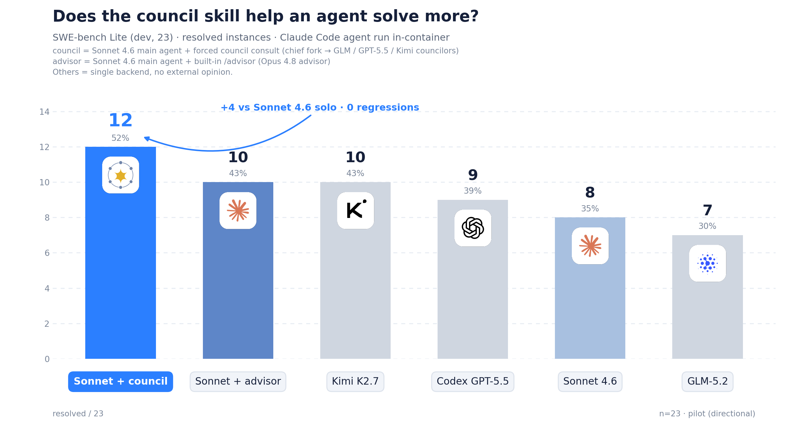

# Council · 为 Claude Code 设计的多模型顾问团 skill

[English](./README.md) · 中文

**Council** (「顾问团」): 这是一个专为 [Claude Code](https://docs.claude.com/en/docs/claude-code) 设计的 skill——在主线 agent 面临关键决策时 (无论是**开工前定方案、需要外部视角判断, 还是产出前复核**), 把当前任务自动转交给一个**由多个外部模型组成的 council** 做独立会商, 再把综合裁断回传给主线 agent 参考。其中每个外部模型称为一个 councilor (顾问), 由 chief (主持) 综合各家意见。

它的灵感来自 Claude Code 内置的 `/advisor`, 但做了两点本质扩展:

- **多 agent 协商**, 而非单一顾问: 多个 councilor 各自独立给出意见, 再由 chief 综合成可执行的裁断;
- **可混搭不同 model + harness**: councilor 可以是任意模型后端 (官方 / 非官方中转), 甚至可以是**完全不同的 harness** (如 OpenAI 的 Codex CLI)。你可以同时让 GLM、Kimi、Codex (gpt-5.5) 在一次会商里发声。


## 效果

在 SWE-bench Lite (dev, 23 题) 上, 给官方 Sonnet 主线 agent 接上 council 会商, 解决数从 **8 → 12**: **Sonnet +4、零回退** (baseline 解出的题 council 版全部保留, 另外多解 4 题), 反超所有单后端裸跑; 也超过同主 agent 配 Claude Code 内置 `/advisor` (单顾问, Opus 4.8) 的 10——多模型协商胜过单一顾问。




## 快速开始

### 安装与配置

如果你是人类，请阅读 [quick_start_for_human_zh](./resources/quick_start_for_human_zh.md) 。

你也可以让你的 Claude Code 帮你安装，只需要在对话界面发送

```text
帮我安装这个 skill，https://github.com/ParadoxZW/council.skill
```

如果你是 agent（收到了用户让你安装这个 skill 的请求），请阅读 [quick_start_for_agent](./resources/quick_start_for_agent.md) ，并帮助用户完成安装。

### 使用

skill 会在合适时机自动触发——主线 agent 在**开工定方案前、产出完成前、卡住或准备改方向时**召集 council; 你也可显式要求 agent "consult the council"，或者发送 "/council" 命令。


## 设计简介
### 核心设计原则

1. **极低的主线调用负担** —— 主线 agent 要召集 council, 只需执行**一条无参脚本**:
   ```shell
   bash "${CLAUDE_SKILL_DIR}/scripts/launch.sh"
   ```
   不传任何参数、不需要主线 agent 自己组织 query。stdout 返回的就是可直接执行的裁断。

2. **最小程度污染主线上下文** —— council 的内部运作 (组织查询、扇出多个 councilor、综合意见) 全部发生在 chief 的上下文里；主线 agent 看不到 council 内部的大量中间产物。

<details>
<summary><b>工作原理</b> (点击展开)</summary>

```
主线 agent (L1)
  └─ bash launch.sh            ← 唯一的调用入口(无参)
        └─ chief (L2)     ← fork 主会话:继承完整对话作为背景,自己组织会商查询
              └─ council.sh    ← 把查询并行扇给各 councilor
                    ├─ councilor A (如 GLM,Claude Code harness)
                    ├─ councilor B (如 Codex gpt-5.5,Codex harness)
                    └─ councilor C (如 Kimi,Claude Code harness)
              ← chief 汇总各家意见 → 一份「裁断」文档
        ← 裁断作为 launch.sh 的 stdout 回到主线 agent
```

- **chief 是主会话的一个 fork**: 因此它**自动继承主线的全部上下文**, 无需主线 agent 手动喂任何信息——这正是"无参调用"得以成立的原因。
- **councilor 是只读的外部意见提供者**: 能读工作目录、联网检索、跑只读命令, 但**不改动文件 / 不动 git**。

</details>


## 许可证

MIT —— 详见 [LICENSE](./LICENSE)。
